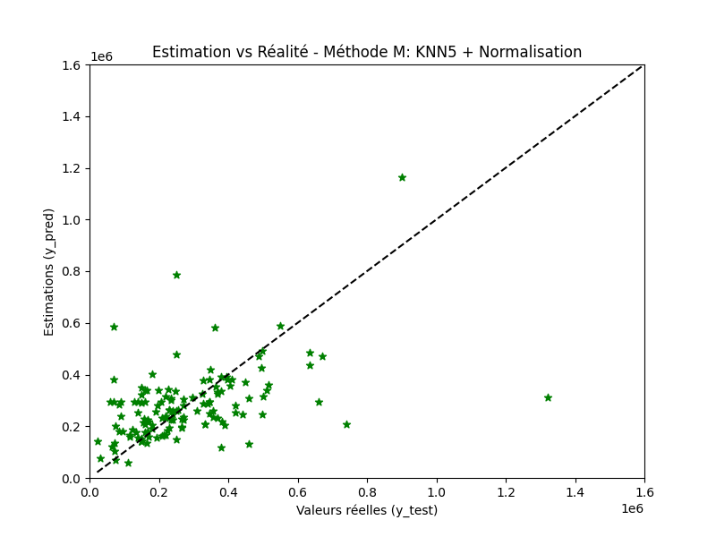
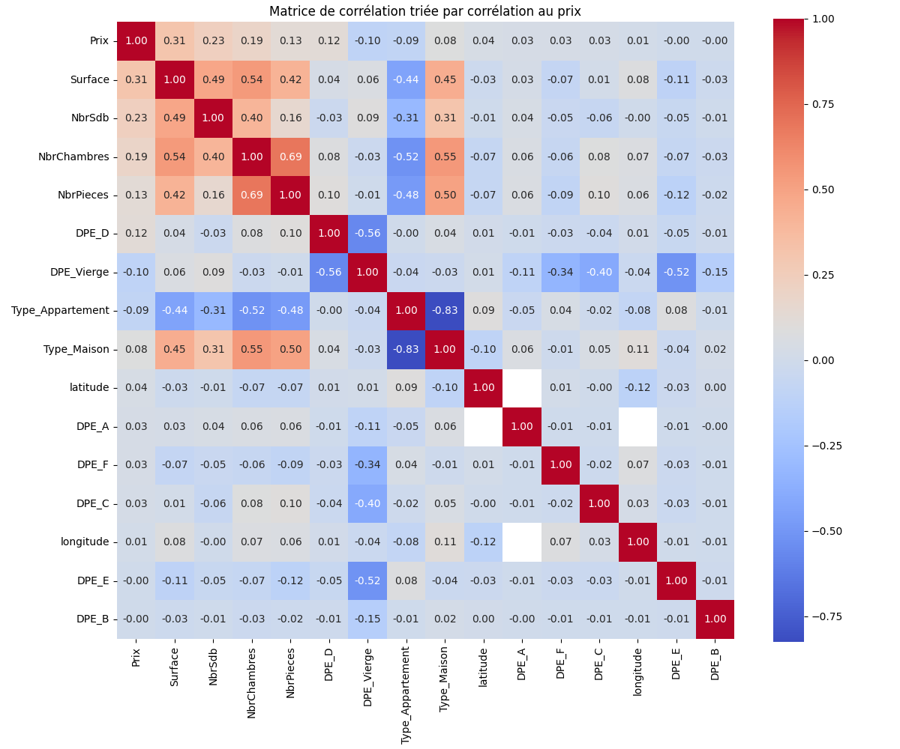

# 🏠 Real Estate Price Prediction via Web Scraping and Machine Learning

*Figure 1 – Predicted vs Actual Prices using Model M (KNN + Normalization)*

*Figure 2 – Correlation Matrix Sorted by Correlation with Price*

---

## 📌 Project Overview

This project focuses on predicting real estate prices in the Île-de-France region using data scraped from the **immo-entre-particuliers.com** website. The process includes web scraping, cleaning and feature engineering, followed by regression modeling and evaluation using machine learning.

---

## 🕸️ Part 1 – Web Scraping

Using `requests` and `BeautifulSoup`, we extract data from multiple listing pages and individual real estate ads. The script captures the following fields:

- **City** (`Ville`)
- **Type** (House or Apartment)
- **Surface area**
- **Number of rooms, bedrooms, and bathrooms**
- **Energy rating (DPE)**
- **Price** (only listings above €10,000)

Data is saved to a CSV file: `annonces_idf.csv`.

---

## 🧹 Part 2 – Data Cleaning & Feature Engineering

The cleaning pipeline includes:

1. **Data inspection** – overview of the dataset.
2. **Handling missing values**:
   - DPE values (`-`) are replaced with `"Vierge"`.
   - Numerical missing values are imputed with column means.
3. **Dummy variable creation**:
   - One-hot encoding for DPE and property types.
4. **Geographic enrichment**:
   - Latitude and longitude added using a secondary CSV (`cities.csv`) with town coordinates.
5. **Text normalization** for city name matching.

Cleaned data is saved as: `annonces_nettoyees.csv`.

---

## 🤖 Part 3 – Modeling & Evaluation

Several regression models were tested to estimate property prices based on the cleaned dataset. The following models and preprocessing techniques were evaluated:

- **Linear Regression (LR)**
- **Decision Tree Regressor** (`DecisionTreeRegressor(max_depth=4)`)
- **K-Nearest Neighbors** (`KNeighborsRegressor(n_neighbors=4)`)
- Preprocessing: `MinMaxScaler` (Normalization) and `StandardScaler` (Standardization)

### Model M: K-Nearest Neighbors (KNN)

- **Final Model**: `KNeighborsRegressor(n_neighbors=5)`
- **Features**: All numeric and encoded variables from the cleaned dataset
- **Preprocessing**: Normalization using `MinMaxScaler`
- **Visualization**:
  - *Figure 1*: Scatter plot comparing predicted vs actual prices
  - *Figure 2*: Heatmap of feature correlations with the target (`Price`)

### Additional Steps:
- Dimensionality reduction using PCA (2 components)
- Comparison of model performance with and without PCA

---

## 📈 Summary of Results

- KNN model on original features performs significantly better than the PCA-reduced model.
- PCA with only 2 components led to underfitting (R² score ≈ -0.03).
- Feature correlation analysis highlights the most impactful variables for price prediction.